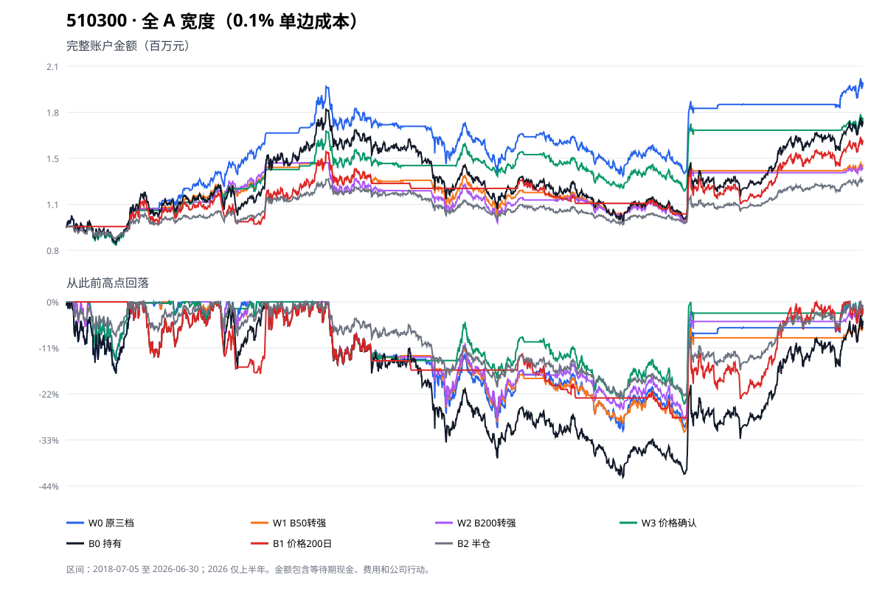
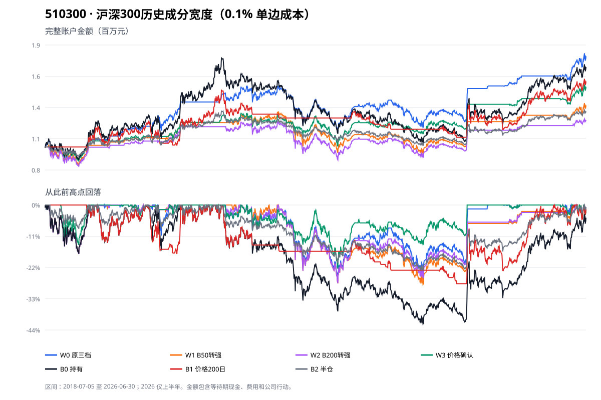
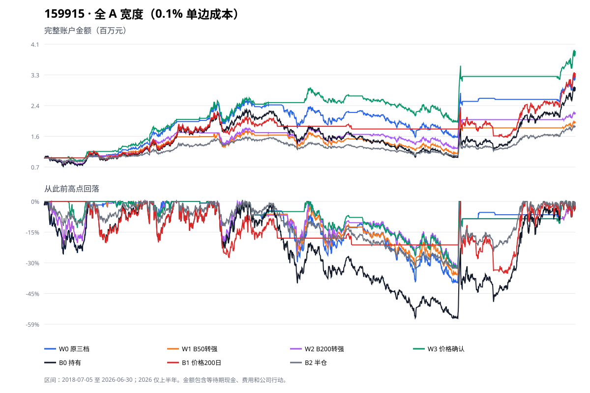

# 两只宽基 ETF：宽度来源与转强确认增量回测

日期：2026-09-09  
主比较区间：2018-07-05 至 2026-06-30；2026 年只到 6 月 30 日。  
主费用：每次买入或卖出合计 0.1%；另有 0.2% 压力检查。每条路径初始 100 万元。

## 一句话结论（大白话）

本轮固定定义的 B50/B200 转强确认，作为原 B200 三档规则的买入或加仓过滤，没有显示值得保留的增量，应暂缓且不继续换参数；但这不能扩大成“宽度没用”。159915 当前最好的完成版本仍是“全 A 宽度＋ETF 价格确认”，510300 的沪深300自身宽度原规则也在本段历史中胜过简单 200 日价格趋势。更准确的收敛方向是：保留这两条有条件线索，下一步用固定的纯 50 日价格趋势挑战宽度组合，再判断宽度是否值得额外的数据和维护成本。

## Executive Summary（结论摘要）

- **问题 1：没有证据支持“自身成分宽度更有用”。** 510300 的原三档 W0，用全 A 后期末 197.33 万元、年化 8.88%、最大回撤 30.98%；换成沪深300当时成分后是 180.67 万元、7.69%、26.89%。全 A 多 16.66 万元，但最深下跌多 4.09 个百分点。159915 自身成分链在 2017 年无法闭合，按事前规则暂停，不能回答哪一种来源更好。
- **问题 2：本轮固定定义的 B50/B200 转强过滤没有显示值得保留的增量。** 相对各自 W0，510300 的 W1/W2 少 43.67 万—57.42 万元，159915 的 W1/W2 少 100.85 万—125.69 万元。防守结果也不一致：159915 的 W1/W2 最大回撤分别少 3.76 和 7.80 个百分点，但 510300 的四条自身比较中有三条反而更深，最长恢复时间也没有普遍改善。因此结论只针对“20 日转强＋只过滤原规则新增投入”这一固定接法，不能写成 B50、B200 或宽度转向普遍无效。
- **问题 3：价格确认更值得继续验证，但还不能淘汰宽度。** W3 不是纯价格策略，而是“原宽度规则＋ETF 高于 50 日均线才新增投入”。159915 的 W3 年化 18.77%、最大回撤 32.40%，同时胜过全 A W0 的 15.95%/39.40%和纯 200 日价格趋势 B1 的 16.30%/34.68%；改善不能全部归给价格，也不能称为宽度单独创造的稳定超额收益。510300 的沪深300自身宽度 W0 为 7.69%/26.89%，也有条件胜过 B1 的 5.92%/27.85%。宽度是否值回名单、退市股票和逐股行情的维护成本，仍需一个对应的纯 50 日价格对手来回答。

本轮完成 18/22 条主路径和对应 18 条压力路径。缺少的 4 条全部是“159915 × 创业板历史成分宽度 × W0—W3”，没有为凑满数量降低资料标准。

## 510300：全 A 收益更高，但自身成分下跌更浅

下表使用共同区间和 0.1% 主费用。“换手 52.9 倍”表示八年里所有买卖金额合计约为初始本金的 52.9 倍，不是一次投入 52.9 倍，也没有杠杆。

| 宽度来源 | 资料等级 | 版本 | 期末资产 | 日历年化 | 最大回撤 | 最长未恢复 | 平均持有比例 | 换手 | 费用 | 实际成交 |
|---|---|---|---:|---:|---:|---:|---:|---:|---:|---:|
| 全 A | B | W0 | 1,973,324元 | 8.88% | -30.98% | 1909天 | 57.3% | 52.9倍 | 52,894元 | 64 |
| 全 A | B | W1 | 1,416,941元 | 4.46% | -31.31% | 1959天（期末未恢复） | 46.8% | 29.2倍 | 29,156元 | 41 |
| 全 A | B | W2 | 1,399,158元 | 4.30% | -28.34% | 1955天（期末未恢复） | 43.4% | 28.9倍 | 28,856元 | 42 |
| 全 A | B | W3 | 1,733,582元 | 7.13% | -24.53% | 1329天 | 44.7% | 36.3倍 | 36,314元 | 48 |
| 沪深300历史成分 | B | W0 | 1,806,707元 | 7.69% | -26.89% | 1302天 | 57.6% | 47.9倍 | 47,941元 | 65 |
| 沪深300历史成分 | B | W1 | 1,370,009元 | 4.02% | -28.17% | 1605天 | 48.7% | 26.6倍 | 26,636元 | 42 |
| 沪深300历史成分 | B | W2 | 1,239,381元 | 2.72% | -27.67% | 1606天 | 47.7% | 28.0倍 | 27,952元 | 46 |
| 沪深300历史成分 | B | W3 | 1,534,358元 | 5.51% | -22.57% | 1187天 | 43.1% | 34.2倍 | 34,169元 | 52 |
| 简单参照 | — | B0 分红再投入持有 | 1,710,357元 | 6.95% | -42.15% | 1959天（期末未恢复） | 100.0% | 1.2倍 | 1,191元 | 9 |
| 简单参照 | — | B1 价格 SMA200 | 1,583,375元 | 5.92% | -27.85% | 1784天 | 56.4% | 44.7倍 | 44,679元 | 39 |
| 简单参照 | — | B2 月末恢复半仓 | 1,317,089元 | 3.51% | -23.17% | 1951天 | 49.5% | 1.6倍 | 1,555元 | 92 |

**只换来源的结果并不单向。** 全 A W0 比沪深300自身 W0 多 16.66 万元，主要优势出现在 2018 年下半年至 2019 年：该段累计收益分别为 34.84% 和 18.35%。2025 年至 2026 上半年反而是自身成分 W0 更高，18.91% 对 9.77%。两者平均持有比例几乎一样，说明差异来自“何时处于哪一档”，不是简单多持仓。

两种来源的 B50 20 日方向在 19.44% 的共同有效交易日不一致，B200 为 20.46%；周度目标档位有 148 周不一致。已能计算的 21 次沪深300换样中，单次成员变化带来的 B200 变化绝对值最高约 3.31 个百分点、B50 约 4.31 个百分点；这足以影响接近阈值的周，但不能把整段差异都解释成换样。

## 159915：宽度＋价格确认是候选，固定宽度转强过滤未显示增量

| 宽度来源 | 资料等级 | 版本 | 期末资产 | 日历年化 | 最大回撤 | 最长未恢复 | 平均持有比例 | 换手 | 费用 | 实际成交 |
|---|---|---|---:|---:|---:|---:|---:|---:|---:|---:|
| 全 A | B | W0 | 3,260,041元 | 15.95% | -39.40% | 1175天 | 57.6% | 68.1倍 | 68,104元 | 64 |
| 全 A | B | W1 | 2,003,099元 | 9.09% | -35.64% | 1175天 | 46.8% | 33.0倍 | 33,012元 | 41 |
| 全 A | B | W2 | 2,251,562元 | 10.70% | -31.60% | 816天 | 43.5% | 35.6倍 | 35,644元 | 42 |
| 全 A | B | W3 | 3,949,286元 | 18.77% | -32.40% | 816天 | 42.6% | 60.2倍 | 60,158元 | 49 |
| 简单参照 | — | B0 分红再投入持有 | 2,947,530元 | 14.49% | -56.58% | 1727天 | 100.0% | 1.0倍 | 999元 | 1 |
| 简单参照 | — | B1 价格 SMA200 | 3,339,084元 | 16.30% | -34.68% | 1329天 | 56.7% | 40.1倍 | 40,078元 | 25 |
| 简单参照 | — | B2 月末恢复半仓 | 1,885,013元 | 8.26% | -32.59% | 1519天 | 49.6% | 2.5倍 | 2,507元 | 95 |

**W3 是本轮唯一同时改善 159915 收益和回撤的确认。** 相对 W0，期末多 68.92 万元，年化高 2.82 个百分点，最大回撤少 7.00 个百分点。W1/W2 虽分别少跌 3.76 和 7.80 个百分点，却少 125.69 万和 100.85 万元。纯 200 日价格趋势 B1 也略胜 W0，并把最大回撤从 39.40% 降到 34.68%；但 W3 相对 B1 仍多 61.02 万元、年化高 2.47 个百分点、最大回撤少 2.28 个百分点，最长恢复时间短 513 天。

这里不能把 W3 的全部改善归给价格，也不能据此声称宽度单独创造了稳定超额收益：W3 同时保留了宽度决定仓位和减仓、又增加价格入场确认，当前只证明这个组合在本段历史值得继续挑战纯价格方法。

这不能被解释为“确认解决了高宽度牛市低仓位问题”。2025 年 159915 持有上涨 51.6%、B1 上涨 29.2%，W0 只上涨 2.1%，W3 为 0%；W3 的全期优势主要在此前累积，而不是修复 2025 年踏空。

## 转强确认到底改变了什么

为避免把连续多天当成很多次机会，本节把“原三档目标第一次提高，直到目标降低”为一段共同原始机会。全 A 有 32 段，沪深300自身宽度有 33 段；这是观察机会，不是 32/33 个彼此独立的统计样本。

先看每个确认相对同来源 W0 的准确差额。最大回撤一栏“+”表示下跌变浅；最长恢复一栏“−”表示恢复更快。

| ETF / 来源 | 确认 | 期末资产差额 | 年化差额 | 最大回撤变化 | 最长恢复变化 | 平均持有变化 | 换手变化 |
|---|---|---:|---:|---:|---:|---:|---:|
| 510300 / 全 A | W1 B50 | -556,383元 | -4.42个百分点 | -0.32个百分点 | +50天，且期末未恢复 | -10.5个百分点 | -23.7倍 |
| 510300 / 全 A | W2 B200 | -574,166元 | -4.59个百分点 | +2.64个百分点 | +46天，且期末未恢复 | -13.8个百分点 | -24.0倍 |
| 510300 / 全 A | W3 价格 | -239,741元 | -1.75个百分点 | +6.45个百分点 | -580天 | -12.6个百分点 | -16.6倍 |
| 510300 / 沪深300 | W1 B50 | -436,698元 | -3.67个百分点 | -1.28个百分点 | +303天 | -8.9个百分点 | -21.3倍 |
| 510300 / 沪深300 | W2 B200 | -567,327元 | -4.96个百分点 | -0.78个百分点 | +304天 | -10.0个百分点 | -20.0倍 |
| 510300 / 沪深300 | W3 价格 | -272,349元 | -2.18个百分点 | +4.32个百分点 | -115天 | -14.6个百分点 | -13.8倍 |
| 159915 / 全 A | W1 B50 | -1,256,941元 | -6.86个百分点 | +3.76个百分点 | 0天 | -10.7个百分点 | -35.1倍 |
| 159915 / 全 A | W2 B200 | -1,008,478元 | -5.25个百分点 | +7.80个百分点 | -359天 | -14.1个百分点 | -32.5倍 |
| 159915 / 全 A | W3 价格 | +689,245元 | +2.82个百分点 | +7.00个百分点 | -359天 | -15.0个百分点 | -7.9倍 |

这张表说明“少赚多少、少跌多少”必须同时看：W2 在 159915 上确实明显减轻回撤和缩短恢复，但年化少 5.25 个百分点；在 510300 自身宽度上，W1/W2 不仅少赚，最大回撤和恢复时间还同时恶化。暂缓 W1/W2 的依据不是只看收益，而是防守收益不稳定、完整资金代价大。

| ETF / 来源 | 确认 | 立即通过 | 延迟通过 | 原理由改变前仍未通过 | 等待中位数 |
|---|---|---:|---:|---:|---:|
| 510300 / 全 A | W1 B50 | 5 | 15 | 12 | 7.5个交易日 |
| 510300 / 全 A | W2 B200 | 6 | 14 | 12 | 6.5个交易日 |
| 510300 / 全 A | W3 价格 | 10 | 14 | 8 | 4个交易日 |
| 510300 / 沪深300 | W1 B50 | 7 | 14 | 12 | 4个交易日 |
| 510300 / 沪深300 | W2 B200 | 5 | 18 | 10 | 7个交易日 |
| 510300 / 沪深300 | W3 价格 | 7 | 19 | 7 | 4个交易日 |
| 159915 / 全 A | W1 B50 | 5 | 15 | 12 | 7.5个交易日 |
| 159915 / 全 A | W2 B200 | 6 | 14 | 12 | 6.5个交易日 |
| 159915 / 全 A | W3 价格 | 13 | 12 | 7 | 4个交易日 |

**宽度确认不是没有避开下跌，而是错过反弹更多。** 例如 159915 的 W1 等待过程中，各机会最差价格变化平均约 -1.87%，说明确实少承受了一些继续下跌；但到确认或取消时，价格相对原本首个可买开盘平均已经高 3.41%。W2 对应为最差 -2.18%、结束 +1.92%。W3 的结束变化平均约 -0.24%，更接近“等到下跌真正缓和后再参与”，这与它最终改善完整账户一致。逐机会明细保存在[共同原始买入机会](raw/research-etf-breadth-confirmation-2026-09-09/diagnostics/common_raw_buy_opportunities.csv)。

## 逐年结果：优势不是每年都有

2018 只从 7 月 5 日开始，2026 只到 6 月 30 日。单位为当年/阶段收益率。

先按事前固定的三个阶段汇总。下表是各阶段完整账户累计收益，不是年化收益；这样能直接看出确认版本的优势是否只来自一段行情。

### 固定阶段汇总：510300

| 路径 | 2018-07-05—2019 | 2020—2024 | 2025—2026上半年 |
|---|---:|---:|---:|
| 全A W0 | 34.8% | 33.3% | 9.8% |
| 全A W1 | 26.3% | 9.0% | 2.9% |
| 全A W2 | 22.6% | 11.2% | 2.6% |
| 全A W3 | 24.7% | 32.3% | 5.1% |
| 沪深300 W0 | 18.4% | 28.4% | 18.9% |
| 沪深300 W1 | 8.2% | 13.2% | 11.8% |
| 沪深300 W2 | 5.2% | 9.1% | 7.9% |
| 沪深300 W3 | 9.3% | 26.1% | 11.3% |
| 纯价格 B1 | 19.4% | 5.3% | 26.0% |

510300 的全 A W0 优势主要来自前两个阶段；沪深300自身 W0 在最后阶段更高。W1/W2 三个阶段都低于同来源 W0，不能用单一行情解释其全期少赚。W3 的防守改善主要换来了较低持有比例，仍未改善全期收益。

### 固定阶段汇总：159915

| 路径 | 2018-07-05—2019 | 2020—2024 | 2025—2026上半年 |
|---|---:|---:|---:|
| 全A W0 | 34.4% | 90.4% | 27.4% |
| 全A W1 | 23.5% | 47.9% | 9.6% |
| 全A W2 | 18.3% | 73.8% | 9.5% |
| 全A W3 | 44.9% | 124.1% | 21.6% |
| 纯价格 B1 | 19.6% | 57.8% | 77.0% |

159915 的 W3 优势集中在 2018—2024，最后阶段明显落后纯价格 B1；所以它是时期依赖的候选，不是已经稳定胜出的生产规则。W1/W2 在三个阶段都低于 W0，本轮没有留下可继续调参的理由。

### 510300

| 路径 | 2018阶段 | 2019 | 2020 | 2021 | 2022 | 2023 | 2024 | 2025 | 2026上半年 |
|---|---:|---:|---:|---:|---:|---:|---:|---:|---:|
| 全A W0 | -10.4% | 50.5% | 29.7% | -4.1% | -9.2% | -5.3% | 24.7% | 1.5% | 8.2% |
| 全A W1 | -10.5% | 41.1% | 12.8% | -7.9% | -8.9% | -7.3% | 24.2% | 0.0% | 2.9% |
| 全A W2 | -10.5% | 37.1% | 16.7% | -13.2% | -7.6% | -4.1% | 24.0% | 0.0% | 2.6% |
| 全A W3 | -11.3% | 40.6% | 18.6% | -4.5% | -0.3% | -7.5% | 26.6% | 0.0% | 5.1% |
| 沪深300 W0 | -10.4% | 32.1% | 18.2% | 8.4% | -16.6% | -0.4% | 20.6% | 7.3% | 10.8% |
| 沪深300 W1 | -14.7% | 26.8% | 12.4% | 6.2% | -18.0% | -4.5% | 21.1% | 4.6% | 7.0% |
| 沪深300 W2 | -16.0% | 25.3% | 12.2% | 2.1% | -17.5% | -2.1% | 18.0% | 3.6% | 4.2% |
| 沪深300 W3 | -11.3% | 23.3% | 11.5% | 3.3% | -10.1% | 2.0% | 19.5% | 3.7% | 7.3% |
| B0 | -10.0% | 38.5% | 29.1% | -4.0% | -20.1% | -9.8% | 17.4% | 20.8% | 8.3% |
| B1 | 0.0% | 19.4% | 13.3% | -7.0% | 0.0% | -8.0% | 8.7% | 16.6% | 8.0% |
| B2 | -7.6% | 18.2% | 14.3% | -1.9% | -10.0% | -4.8% | 9.4% | 10.1% | 4.2% |

### 159915

| 路径 | 2018阶段 | 2019 | 2020 | 2021 | 2022 | 2023 | 2024 | 2025 | 2026上半年 |
|---|---:|---:|---:|---:|---:|---:|---:|---:|---:|
| 全A W0 | -19.1% | 66.1% | 62.1% | 13.0% | -14.9% | -8.3% | 33.2% | 2.1% | 24.8% |
| 全A W1 | -17.2% | 49.1% | 28.5% | 2.6% | -10.6% | -9.1% | 38.1% | 0.0% | 9.6% |
| 全A W2 | -17.2% | 42.8% | 42.9% | 0.3% | -6.9% | -4.8% | 36.8% | 0.0% | 9.5% |
| 全A W3 | -7.7% | 57.0% | 54.8% | 12.7% | 0.7% | -6.6% | 36.8% | 0.0% | 21.6% |
| B0 | -19.3% | 44.9% | 65.7% | 12.3% | -29.2% | -19.2% | 14.1% | 51.6% | 37.0% |
| B1 | 0.0% | 19.6% | 65.7% | 0.0% | -5.5% | -4.0% | 5.0% | 29.2% | 37.0% |
| B2 | -10.4% | 21.6% | 30.7% | 6.5% | -14.9% | -9.8% | 10.6% | 24.5% | 17.6% |

完整机器明细见[逐年 CSV](raw/research-etf-breadth-confirmation-2026-09-09/results/annual.csv)和[固定阶段 CSV](raw/research-etf-breadth-confirmation-2026-09-09/results/periods.csv)。固定三阶段受资料限制调整为“2018-07-05—2019、2020—2024、2025—2026上半年”，没有事后挑日期。

## 更长的沪深300资料不能与主表混排

沪深300自身宽度从 2015-02-09 已有部分合格数据，因此另跑了同来源较长区间，不与 2018 起的来源比较混在一起。0.1% 下：W0 期末 168.65 万元、年化 4.70%、最大回撤 26.89%；B0 为 183.98 万元、5.50%、45.43%；B1 为 168.62 万元、4.70%、42.31%；B2 为 138.17 万元、2.88%、25.00%。W0 与 B1 的期末只差约 355 元，且低于持有 15.33 万元，说明共同区间里看见的宽度收益优势对起点很敏感。完整结果见[较长区间摘要](raw/research-etf-breadth-confirmation-2026-09-09/results/longer-csi300-only-2015-02-09/summary.csv)。

## 费用翻倍后，两个宽度候选仍保留线索

下表只列当前取舍需要的核心版本；费用是每次买入或卖出合计 0.2%。主路径与压力路径不能当作两份独立成功样本。完整结果见[总摘要](raw/research-etf-breadth-confirmation-2026-09-09/results/summary.csv)。

| ETF | 路径 | 期末资产 | 日历年化 | 最大回撤 | 最长未恢复 | 平均持有比例 | 换手 | 费用 |
|---|---|---:|---:|---:|---:|---:|---:|---:|
| 510300 | 全A W0 | 1,905,297元 | 8.41% | -31.95% | 1951天 | 57.3% | 51.9倍 | 103,804元 |
| 510300 | 全A W3 | 1,687,332元 | 6.77% | -25.36% | 1329天 | 44.7% | 35.8倍 | 71,583元 |
| 510300 | 沪深300 W0 | 1,744,402元 | 7.22% | -27.04% | 1414天 | 57.6% | 47.1倍 | 94,110元 |
| 510300 | 沪深300 W3 | 1,491,729元 | 5.14% | -22.77% | 1219天 | 43.1% | 33.7倍 | 67,336元 |
| 510300 | 持有 B0 | 1,708,375元 | 6.94% | -42.15% | 1959天（期末未恢复） | 100.0% | 1.2倍 | 2,379元 |
| 510300 | 纯价格 B1 | 1,523,000元 | 5.41% | -29.77% | 1905天 | 56.4% | 43.8倍 | 87,625元 |
| 510300 | 半仓 B2 | 1,315,256元 | 3.49% | -23.20% | 1951天 | 49.5% | 1.6倍 | 3,113元 |
| 159915 | 全A W0 | 3,147,467元 | 15.44% | -40.22% | 1175天 | 57.6% | 66.7倍 | 133,478元 |
| 159915 | 全A W3 | 3,843,850元 | 18.36% | -32.89% | 824天 | 42.6% | 59.2倍 | 118,409元 |
| 159915 | 持有 B0 | 2,944,514元 | 14.48% | -56.58% | 1727天 | 100.0% | 1.0倍 | 1,996元 |
| 159915 | 纯价格 B1 | 3,256,579元 | 15.93% | -35.14% | 1329天 | 56.7% | 39.6倍 | 79,129元 |
| 159915 | 半仓 B2 | 1,881,351元 | 8.23% | -32.62% | 1519天 | 49.6% | 2.5倍 | 5,011元 |

费用翻倍后，159915 的 W3 相对纯价格 B1 仍多 58.73 万元、年化高 2.43 个百分点、最大回撤少 2.25 个百分点、最长恢复短 505 天，但换手多 19.6 倍、费用多 3.93 万元。510300 的沪深300自身 W0 相对 B1 仍年化高 1.81 个百分点、最大回撤少 2.74 个百分点、最长恢复短 491 天，但换手和资料维护成本更高。这两条线索足以阻止“淘汰宽度”的结论，却还不足以证明复杂度已经值回成本。

## 数据资格决定了结论上限

| 来源 | 等级 | 实际资格 | 对结论的影响 |
|---|---|---|---|
| 全 A | B：有条件重建 | 沪深 A 股长历史面板可按同分母重算 B50/B200，但历史退市股票与当时完整上市范围未绑定；主区间仅 1884/2790 个交易日达到90%覆盖，首个合格日为2018-07-05，2021年另有52个失效日 | 只能作为有条件比较，不能把收益差全归因于宽度来源 |
| 沪深300历史成分 | B：有条件重建 | 依据已重建的历史成分名单计算，非当前成分倒填；每日名义名单规模保持300只，但有效计算分母还要剔除缺行情或不足200日历史的成员。每20个交易日探测一次，发现变化后定位生效日；逐股价格仍来自上述历史面板 | 可以进入共同区间，但同一20日内换出又换回可能漏检，且旧成分缺失会降低有效覆盖，因此不是A级 |
| 创业板历史成分 | C：不足比较 | 使用深交所定期调样公告、2024年ST临时替换和2025年代码变更反向重建；到2017-10-09时名单从100只异常变成101只，缺少数字政通（300075）后来退出的完整官方链 | 自身宽度4条全部暂停；绝不以整个创业板或今天名单代替 |

创业板公告来自[深交所指数动态](https://www.szse.cn/marketServices/message/index/dynamic/)；2024 年临时替换来自[国证指数公告](https://www.cnindex.com.cn/zh_information/notices_news/2024y/202408/P020240805528066886656.pdf)，2025 年证券代码变更来自[国证指数公告](https://www.cnindex.com.cn/zh_information/notices_news/2025/202502/P020250212310734081331.pdf)。保存的原公告、公告日、生效日、进出名单及失败点见[资料目录](raw/research-etf-breadth-confirmation-2026-09-09/prepared/)。

## 建议与后续问题

1. **不修改生产规则。** 暂缓本轮固定的 W1/W2 接法，不继续更换回看期或阈值；这不是淘汰 B50、B200 或宽度。W3 与沪深300自身 W0 只保留研究候选，不直接采用。
2. **下一轮最多增加一个固定对手。** 在不扫描均线长度的前提下，新增纯 50 日价格趋势：收盘价高于自身 50 日均线则下一可成交日开盘满仓，否则退出留现金。它是简单替代方案，不是严格只移除宽度的单变量实验；目的只是先判断 W3 是否值得宽度这份复杂度。本轮不自动执行该实验。
3. **资料补齐与策略挑战分开。** 创业板自身宽度继续标为未知/未完成；全 A 要补历史退市股票的逐日上市范围，沪深300要保留短期成员变化可能漏识别的 B 级限制。科创100仍不在范围内。
4. **仍需回答的开放问题。** 纯 50 日趋势能否接近或超过 W3；W3 对 159915 的优势是否过度集中在 2018—2024；资料补齐后创业板自身宽度能否改变结论；以及更高换手和真实成交限制会不会吃掉历史优势。

## 方法、复核与边界

- 原 B200 阈值、周频、首次建仓、5个百分点等待、下一开盘、整百份、现金/应收分红、公司行动与不可成交处理均先写入[冻结协议](raw/research-etf-breadth-confirmation-2026-09-09/protocol.md)。旧九指数实现是收盘、小数单位及每日检查，本轮不能称原收益原样复现。
- W1/W2/W3 只过滤新增投入，不改变减仓。未确认会等待，原目标变化即更新或取消；确认后来转负不卖。B2 在 2026-06-30 月末生成的下一交易日调整尚未成交，期末按实际持仓估值，没有虚构未来成交。
- 边界例共 7 项通过；36 条主/压力账户由独立算术程序从日账和成交重算期末资产、年化、回撤、平均持有、换手、费用和笔数，最大差异约 `7.3e-12`，全部通过。见[独立复核](raw/research-etf-breadth-confirmation-2026-09-09/diagnostics/independent_arithmetic_check.json)。
- 机会诊断只描述这段历史，不把32/33段机会当独立概率样本。没有扫描回看期、确认天数、平滑方式、阈值或单独为两只ETF找参数。
- 本轮没有修改生产规则、真实交易、OKR 或旧封存。

## ARCHIVE

本轮按“宽度择时 / mixed”归档：18/22 条主路径与18条压力路径完成，账户算术复核通过；仅暂缓本轮固定定义、固定接法的 B50/B200 转强过滤，不扩大为宽度无效。159915 的“全 A 宽度＋50日价格确认”和 510300 的沪深300自身宽度原规则保留继续验证；创业板自身宽度因历史成分链 C 级暂停，全 A 与沪深300均为 B 级，因此不构成生产采用依据。
